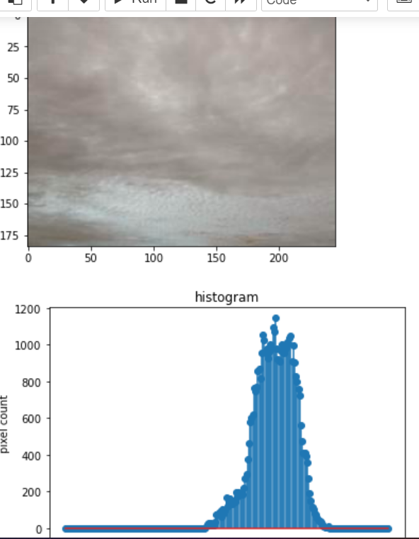
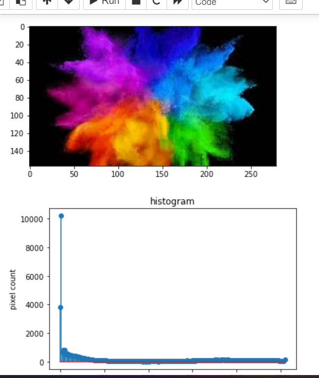
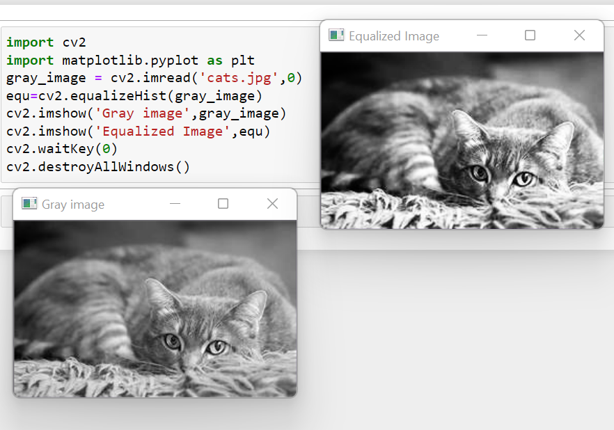

# Histogram and Histogram Equalization of an image
## Aim
To obtain a histogram for finding the frequency of pixels in an Image with pixel values ranging from 0 to 255. Also write the code using OpenCV to perform histogram equalization.

## Software Required:
Anaconda - Python 3.7

## Algorithm:
### Step1:
Import all the necessary libraries.

### Step2:
Read the images using imread() function.

### Step3:
Using calcHist() we can find the histogram of the images.

### Step4:
Using equalizeHist() we can equalize the image.

### Step5:
Using matplotlib.pyplot plot the histogram.

## Program:
```python
# Developed By:Chevula.Nagadurga
# Register Number:21221230014
import cv2
import matplotlib.pyplot as plt

# Write your code to find the histogram of gray scale image and display the histogram of grey scale image.
import cv2
import matplotlib.pyplot as plt
gray_image=cv2.imread('grey image.jpg')
hist=cv2.calcHist([gray_image],[0],None,[256],[0,256])
plt.imshow(gray_image)
plt.show()
plt.figure()
plt.title("histogram")
plt.xlabel('grayscale value')
plt.ylabel('pixel count')
plt.stem(hist)
plt.show()


# Write your code to find the histogram of color scale image and display the histogram of color scale image.
import cv2
import matplotlib.pyplot as plt
color_image=cv2.imread('color im.jpg')
hist=cv2.calcHist([color_image],[0],None,[256],[0,256])
plt.imshow(color_image)
plt.show()
plt.figure()
plt.title("histogram")
plt.xlabel('colorscale value')
plt.ylabel('pixel count')
plt.stem(hist)
plt.show()


# Write the code to perform histogram equalization of the image. 

import cv2
import matplotlib.pyplot as plt
gray_image = cv2.imread('cats.jpg',0)
equ=cv2.equalizeHist(gray_image)
cv2.imshow('Gray image',gray_image)
cv2.imshow('Equalized Image',equ)
cv2.waitKey(0)
cv2.destroyAllWindows()


```
## Output:
### Input Grayscale Image and histogram of grey scale image.


### Input Grayscale Image and histogram of grey scale image.e

### Histogram Equalization of Grayscale Image

## Result: 
Thus the histogram for finding the frequency of pixels in an image with pixel values ranging from 0 to 255 is obtained. Also,histogram equalization is done for the gray scale image using OpenCV.
